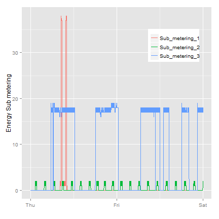
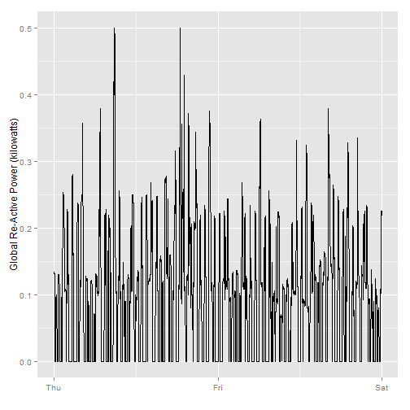
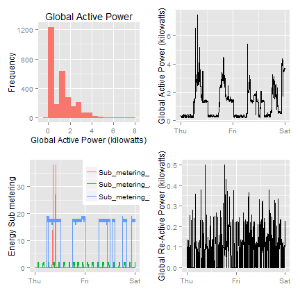

# Peer assignment 1; Exploratory Data Analysis
--- 

## Abstract
This script file will read the csv file and tidy it, and saves the subset based on the provided period.

## Data description
 * Dataset: Electric power consumption [20Mb]
 * Description: Measurements of electric power consumption in one household with a one-minute sampling rate over a period of almost 4 years. Different electrical quantities and some sub-metering values are available.

The following descriptions of the 9 variables in the dataset are taken from the UCI web site:
  1. Date: Date in format dd/mm/yyyy 
  2. Time: time in format hh:mm:ss 
  3. Global_active_power: household global minute-averaged active power (in kilowatt) 
  4. Global_reactive_power: household global minute-averaged reactive power (in kilowatt) 
  5. Voltage: minute-averaged voltage (in volt) 
  6. Global_intensity: household global minute-averaged current intensity (in ampere) 
  7. Sub_metering_1: energy sub-metering No. 1 (in watt-hour of active energy). It corresponds to the kitchen, containing mainly a dishwasher, an oven and a microwave (hot plates are not electric but gas powered). 
  8. Sub_metering_2: energy sub-metering No. 2 (in watt-hour of active energy). It corresponds to the laundry room, containing a washing-machine, a tumble-drier, a refrigerator and a light. 
  9. Sub_metering_3: energy sub-metering No. 3 (in watt-hour of active energy). It corresponds to an electric water-heater and an air-conditioner.

## Loading required libraries
 
I decided to use the `data.table` library to read the file. The knitr library is used for creating markdown documents. 


```r

## install.packages('data.table') ## optional for read.table
## install.packages('knitr') ## optional for markdown
library(data.table)  ## for read.table
library(knitr)  ## for markdown
```


## Read the text file 
I have set the data directory differently than the script folder, to prevent the data being synced with the github data we put the folder in a different location

As mentioned in the supporting documentation the dataset has 2,075,259 rows of 9 columns. 

```r

dat <- read.table(file = "~/Courses/R-ExploratoryDataAnalysis/Data/power_consumption/household_power_consumption.txt", 
    header = TRUE, sep = ";", na.strings = "?", stringsAsFactors = FALSE)
str(dat)
```

```
## 'data.frame':	2075259 obs. of  9 variables:
##  $ Date                 : chr  "16/12/2006" "16/12/2006" "16/12/2006" "16/12/2006" ...
##  $ Time                 : chr  "17:24:00" "17:25:00" "17:26:00" "17:27:00" ...
##  $ Global_active_power  : num  4.22 5.36 5.37 5.39 3.67 ...
##  $ Global_reactive_power: num  0.418 0.436 0.498 0.502 0.528 0.522 0.52 0.52 0.51 0.51 ...
##  $ Voltage              : num  235 234 233 234 236 ...
##  $ Global_intensity     : num  18.4 23 23 23 15.8 15 15.8 15.8 15.8 15.8 ...
##  $ Sub_metering_1       : num  0 0 0 0 0 0 0 0 0 0 ...
##  $ Sub_metering_2       : num  1 1 2 1 1 2 1 1 1 2 ...
##  $ Sub_metering_3       : num  17 16 17 17 17 17 17 17 17 16 ...
```


The next step is to combine the date and time columns to a single datetime columns and remove the old columns


```r

dat$TimeStamp <- strptime(paste(dat$Date, dat$Time, sep = " "), "%d/%m/%Y %H:%M:%S")
## Check the structure
str(dat)
```

```
## 'data.frame':	2075259 obs. of  10 variables:
##  $ Date                 : chr  "16/12/2006" "16/12/2006" "16/12/2006" "16/12/2006" ...
##  $ Time                 : chr  "17:24:00" "17:25:00" "17:26:00" "17:27:00" ...
##  $ Global_active_power  : num  4.22 5.36 5.37 5.39 3.67 ...
##  $ Global_reactive_power: num  0.418 0.436 0.498 0.502 0.528 0.522 0.52 0.52 0.51 0.51 ...
##  $ Voltage              : num  235 234 233 234 236 ...
##  $ Global_intensity     : num  18.4 23 23 23 15.8 15 15.8 15.8 15.8 15.8 ...
##  $ Sub_metering_1       : num  0 0 0 0 0 0 0 0 0 0 ...
##  $ Sub_metering_2       : num  1 1 2 1 1 2 1 1 1 2 ...
##  $ Sub_metering_3       : num  17 16 17 17 17 17 17 17 17 16 ...
##  $ TimeStamp            : POSIXlt, format: "2006-12-16 17:24:00" "2006-12-16 17:25:00" ...
```

```r

```


## create subset based on the date boundaries
We will only be using data from the dates 2007-02-01 and 2007-02-02. One alternative is to read the data from just those dates rather than reading in the entire dataset and subsetting to those dates.We will convert the Date and Time variables to Date/Time classes in R using the strptime() and as.Date() functions.

Subset based on the provided date boundary variables


```r

selectedPeriod <- dat[with(dat, !is.na(TimeStamp) & TimeStamp > strptime("01/02/2007 00:00:00", 
    "%d/%m/%Y %H:%M:%S") & TimeStamp < strptime("03/02/2007 00:00:00", "%d/%m/%Y %H:%M:%S")), 
    ]
str(selectedPeriod)
```

```
## 'data.frame':	2879 obs. of  10 variables:
##  $ Date                 : chr  "1/2/2007" "1/2/2007" "1/2/2007" "1/2/2007" ...
##  $ Time                 : chr  "00:01:00" "00:02:00" "00:03:00" "00:04:00" ...
##  $ Global_active_power  : num  0.326 0.324 0.324 0.322 0.32 0.32 0.32 0.32 0.236 0.226 ...
##  $ Global_reactive_power: num  0.13 0.132 0.134 0.13 0.126 0.126 0.126 0.128 0 0 ...
##  $ Voltage              : num  243 244 244 243 242 ...
##  $ Global_intensity     : num  1.4 1.4 1.4 1.4 1.4 1.4 1.4 1.4 1 1 ...
##  $ Sub_metering_1       : num  0 0 0 0 0 0 0 0 0 0 ...
##  $ Sub_metering_2       : num  0 0 0 0 0 0 0 0 0 0 ...
##  $ Sub_metering_3       : num  0 0 0 0 0 0 0 0 0 0 ...
##  $ TimeStamp            : POSIXlt, format: "2007-02-01 00:01:00" "2007-02-01 00:02:00" ...
```


## clean up the date and time columns and save as a csv file.

```r

## remove the individual date and time columns
selectedPeriod$Date <- NULL
selectedPeriod$Time <- NULL
write.csv(selectedPeriod, "~/Courses/R-ExploratoryDataAnalysis/Data/ExData_Plotting1/tidy.csv", 
    row.names = FALSE)
```


## Create plot1.R histogram to visualize the data
The script file reads in the data from the previously created `tidy.csv` data set and builds a histogram. 


```r

## Plot1.R
library(ggplot2)  ## for ggplot
library(scales)  ## for date scales
library(reshape2)  # for melt
library(plyr)  # for colwise

plot1 <- function(sourcePath) {
    period <- read.csv(paste(sourcePath, "/tidy.csv", sep = ""), stringsAsFactors = FALSE)
    graph <- ggplot(period, aes(x = Global_active_power)) + geom_histogram(aes(fill = "red", 
        colour = "black"), binwidth = 0.5) + xlab("Global Active Power (kilowatts)") + 
        ylab("Frequency") + labs(title = "Global Active Power") + theme(legend.position = "none")
    ## next save the result to a png file
    ggsave(file = paste(sourcePath, "/figure/plot1.png", sep = ""), plot = graph, 
        dpi = 480)
    return(graph)
}

plot1("~/Courses/R-ExploratoryDataAnalysis/Data/ExData_Plotting1")
```

```
## Saving 6 x 6 in image
```

 

```r

```


## Create plot2.R graph 
The script file reads in the data from the previously created `tidy.csv` data set and builds the plot. 


```r

## Plot2.R
## Load required libraries
library(ggplot2) ## for ggplot
library(scales) ## for date scales

plot2 <- function(sourcePath) {
  period <- read.csv(paste(sourcePath,"/tidy.csv",sep=""),stringsAsFactors=FALSE)
  ## read the date / time information
  period$TimeStamp <- strptime(period$TimeStamp, "%Y-%m-%d %H:%M:%S")
  graph <- ggplot(period, aes(x=TimeStamp, y=Global_active_power)) +
    scale_x_datetime(breaks= "1 day", labels = date_format("%a")) +  ## per day with short weekday labels
    geom_line() + 
    xlab("") + ## remove x axis label
    ylab("Global Active Power (kilowatts)") 
  ## next save the result to a png file and return the plot
  ggsave(file=paste(sourcePath,"/figure/plot2.png", sep=""), plot=graph, dpi=480)
  return(graph)
}

plot2("~/Courses/R-ExploratoryDataAnalysis/Data/ExData_Plotting1")
```

```
## Saving 6 x 6 in image
```

 

```r

```


## Create plot3.R graph 
The script file reads in the data from the previously created `tidy.csv` data set and builds the plot. 


```r

## Plot3.R
## Load required libraries
library(ggplot2) ## for ggplot
library(scales) ## for date scales
library(reshape2) # for melt
library(plyr) # for colwise

plot3 <- function(sourcePath) {
  ## Load the previously created tidy dataset
  period <- read.csv(paste(sourcePath,"/tidy.csv",sep=""),stringsAsFactors=FALSE)
  ## show the structure of the data
  str(period)
  ## melt the data
  period <- period[,5:8] ## only last four variables are required.
  period <- melt(period, names(period)[4], names(period)[1:3])
  
  ## convert the date/time string information
  period$TimeStamp <- strptime(period$TimeStamp, "%Y-%m-%d %H:%M:%S")
  
  ## first create a plot on the screen using ggplot
  graph <- ggplot(period, aes(x=TimeStamp, y=value,colour=variable)) +
    scale_x_datetime(breaks= "1 day", labels = date_format("%a")) +  ## per day with short weekday labels
    geom_line() + 
    xlab("") + ## remove x axis label
    ylab("Energy Sub metering") + ## set y axis label
    ## theme_classic() + ## basic theme to mimic plot
    theme(legend.position=c(.8,.8)) + ## legend top right
    theme(legend.title=element_blank())   ## remove legend title
    
  ## next save the result to a png file
  ggsave(file=paste(sourcePath,"/figure/plot3.png", sep=""), plot=graph, dpi=480)
  return(graph)
}

plot3("~/Courses/R-ExploratoryDataAnalysis/Data/ExData_Plotting1")
```

```
## 'data.frame':	2879 obs. of  8 variables:
##  $ Global_active_power  : num  0.326 0.324 0.324 0.322 0.32 0.32 0.32 0.32 0.236 0.226 ...
##  $ Global_reactive_power: num  0.13 0.132 0.134 0.13 0.126 0.126 0.126 0.128 0 0 ...
##  $ Voltage              : num  243 244 244 243 242 ...
##  $ Global_intensity     : num  1.4 1.4 1.4 1.4 1.4 1.4 1.4 1.4 1 1 ...
##  $ Sub_metering_1       : int  0 0 0 0 0 0 0 0 0 0 ...
##  $ Sub_metering_2       : int  0 0 0 0 0 0 0 0 0 0 ...
##  $ Sub_metering_3       : int  0 0 0 0 0 0 0 0 0 0 ...
##  $ TimeStamp            : chr  "2007-02-01 00:01:00" "2007-02-01 00:02:00" "2007-02-01 00:03:00" "2007-02-01 00:04:00" ...
```

```
## Saving 6 x 6 in image
```

 

```r

```


## Create plot5.R graph 
The script file reads in the data from the previously created `tidy.csv` data set and builds the plot shown in the right lower corner of the assignment. This plot is not saved


```r
## Plot5.R
## Load required libraries
library(ggplot2) ## for ggplot
library(scales) ## for date scales

plot5 <- function(sourcePath) {
  period <- read.csv(paste(sourcePath,"/tidy.csv",sep=""),stringsAsFactors=FALSE)
  ## read the date / time information
  period$TimeStamp <- strptime(period$TimeStamp, "%Y-%m-%d %H:%M:%S")
  graph <- ggplot(period, aes(x=TimeStamp, y=Global_reactive_power)) +
    scale_x_datetime(breaks= "1 day", labels = date_format("%a")) +  ## per day with short weekday labels
    geom_line() + 
    xlab("") + ## remove x axis label
    ylab("Global Re-Active Power (kilowatts)") 
  ## next save the result to a png file and return the plot
  ## ggsave(file=paste(sourcePath,"/figure/plot5.png", sep=""), plot=graph, dpi=480)
  return(graph)
}

plot5("~/Courses/R-ExploratoryDataAnalysis/Data/ExData_Plotting1")
```

 


## Consolidate the plots into a single composition by creating plot4.R

```r
library(ggplot2)  ## for ggplot
library(gridExtra)
```

```
## Loading required package: grid
```

```r

plot4 <- function(sourcePath) {
    ## Load the plot script files
    source(paste(sourcePath, "/plot1.R", sep = ""))
    source(paste(sourcePath, "/plot2.R", sep = ""))
    source(paste(sourcePath, "/plot3.R", sep = ""))
    source(paste(sourcePath, "/plot5.R", sep = ""))
    plot1 <- plot1(sourcePath)
    plot2 <- plot2(sourcePath)
    plot3 <- plot3(sourcePath)
    plot5 <- plot5(sourcePath)
    ## arrange the plots into a single composition
    graph <- arrangeGrob(plot1, plot2, plot3, plot5, nrow = 2, ncol = 2)
    ## Save the plot and return the plot
    ggsave(file = paste(sourcePath, "/figure/plot4.png", sep = ""), plot = graph, 
        dpi = 480)
    return(graph)
}

plot4("~/Courses/R-ExploratoryDataAnalysis/Data/ExData_Plotting1")
```

```
## Saving 6 x 6 in image
## Saving 6 x 6 in image
```

```
## 'data.frame':	2879 obs. of  8 variables:
##  $ Global_active_power  : num  0.326 0.324 0.324 0.322 0.32 0.32 0.32 0.32 0.236 0.226 ...
##  $ Global_reactive_power: num  0.13 0.132 0.134 0.13 0.126 0.126 0.126 0.128 0 0 ...
##  $ Voltage              : num  243 244 244 243 242 ...
##  $ Global_intensity     : num  1.4 1.4 1.4 1.4 1.4 1.4 1.4 1.4 1 1 ...
##  $ Sub_metering_1       : int  0 0 0 0 0 0 0 0 0 0 ...
##  $ Sub_metering_2       : int  0 0 0 0 0 0 0 0 0 0 ...
##  $ Sub_metering_3       : int  0 0 0 0 0 0 0 0 0 0 ...
##  $ TimeStamp            : chr  "2007-02-01 00:01:00" "2007-02-01 00:02:00" "2007-02-01 00:03:00" "2007-02-01 00:04:00" ...
```

```
## Saving 6 x 6 in image
## Saving 6 x 6 in image
```

 

