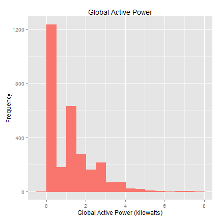
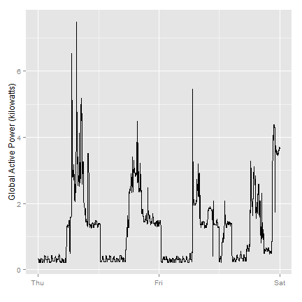

# Peer assignment 1; Exploratory Data Analysis
--- 

## Abstract
This script file will read the csv file and tidy it, and saves the subset based on the provided period.

## Data description
 * Dataset: Electric power consumption [20Mb]
 * Description: Measurements of electric power consumption in one household with a one-minute sampling rate over a period of almost 4 years. Different electrical quantities and some sub-metering values are available.

The following descriptions of the 9 variables in the dataset are taken from the UCI web site:
  1. Date: Date in format dd/mm/yyyy 
  2. Time: time in format hh:mm:ss 
  3. Global_active_power: household global minute-averaged active power (in kilowatt) 
  4. Global_reactive_power: household global minute-averaged reactive power (in kilowatt) 
  5. Voltage: minute-averaged voltage (in volt) 
  6. Global_intensity: household global minute-averaged current intensity (in ampere) 
  7. Sub_metering_1: energy sub-metering No. 1 (in watt-hour of active energy). It corresponds to the kitchen, containing mainly a dishwasher, an oven and a microwave (hot plates are not electric but gas powered). 
  8. Sub_metering_2: energy sub-metering No. 2 (in watt-hour of active energy). It corresponds to the laundry room, containing a washing-machine, a tumble-drier, a refrigerator and a light. 
  9. Sub_metering_3: energy sub-metering No. 3 (in watt-hour of active energy). It corresponds to an electric water-heater and an air-conditioner.

## Loading required libraries
 
I decided to use the `data.table` library to read the file. The knitr library is used for creating markdown documents. 


```r

## install.packages('data.table') ## optional for read.table
## install.packages('knitr') ## optional for markdown
library(data.table)  ## for read.table
library(knitr)  ## for markdown
```


## Read the text file 
I have set the data directory differently than the script folder, to prevent the data being synced with the github data we put the folder in a different location

As mentioned in the supporting documentation the dataset has 2,075,259 rows of 9 columns. 

```r

dat <- read.table(file = "~/Courses/R-ExploratoryDataAnalysis/Data/power_consumption/household_power_consumption.txt", 
    header = TRUE, sep = ";", na.strings = "?", stringsAsFactors = FALSE)
str(dat)
```

```
## 'data.frame':	2075259 obs. of  9 variables:
##  $ Date                 : chr  "16/12/2006" "16/12/2006" "16/12/2006" "16/12/2006" ...
##  $ Time                 : chr  "17:24:00" "17:25:00" "17:26:00" "17:27:00" ...
##  $ Global_active_power  : num  4.22 5.36 5.37 5.39 3.67 ...
##  $ Global_reactive_power: num  0.418 0.436 0.498 0.502 0.528 0.522 0.52 0.52 0.51 0.51 ...
##  $ Voltage              : num  235 234 233 234 236 ...
##  $ Global_intensity     : num  18.4 23 23 23 15.8 15 15.8 15.8 15.8 15.8 ...
##  $ Sub_metering_1       : num  0 0 0 0 0 0 0 0 0 0 ...
##  $ Sub_metering_2       : num  1 1 2 1 1 2 1 1 1 2 ...
##  $ Sub_metering_3       : num  17 16 17 17 17 17 17 17 17 16 ...
```


The next step is to combine the date and time columns to a single datetime columns and remove the old columns


```r

dat$TimeStamp <- strptime(paste(dat$Date, dat$Time, sep = " "), "%d/%m/%Y %H:%M:%S")
## Check the structure
str(dat)
```

```
## 'data.frame':	2075259 obs. of  10 variables:
##  $ Date                 : chr  "16/12/2006" "16/12/2006" "16/12/2006" "16/12/2006" ...
##  $ Time                 : chr  "17:24:00" "17:25:00" "17:26:00" "17:27:00" ...
##  $ Global_active_power  : num  4.22 5.36 5.37 5.39 3.67 ...
##  $ Global_reactive_power: num  0.418 0.436 0.498 0.502 0.528 0.522 0.52 0.52 0.51 0.51 ...
##  $ Voltage              : num  235 234 233 234 236 ...
##  $ Global_intensity     : num  18.4 23 23 23 15.8 15 15.8 15.8 15.8 15.8 ...
##  $ Sub_metering_1       : num  0 0 0 0 0 0 0 0 0 0 ...
##  $ Sub_metering_2       : num  1 1 2 1 1 2 1 1 1 2 ...
##  $ Sub_metering_3       : num  17 16 17 17 17 17 17 17 17 16 ...
##  $ TimeStamp            : POSIXlt, format: "2006-12-16 17:24:00" "2006-12-16 17:25:00" ...
```

```r

```


## create subset based on the date boundaries
We will only be using data from the dates 2007-02-01 and 2007-02-02. One alternative is to read the data from just those dates rather than reading in the entire dataset and subsetting to those dates.We will convert the Date and Time variables to Date/Time classes in R using the strptime() and as.Date() functions.

Subset based on the provided date boundary variables


```r

selectedPeriod <- dat[with(dat, !is.na(TimeStamp) & TimeStamp > strptime("01/02/2007 00:00:00", 
    "%d/%m/%Y %H:%M:%S") & TimeStamp < strptime("03/02/2007 00:00:00", "%d/%m/%Y %H:%M:%S")), 
    ]
str(selectedPeriod)
```

```
## 'data.frame':	2879 obs. of  10 variables:
##  $ Date                 : chr  "1/2/2007" "1/2/2007" "1/2/2007" "1/2/2007" ...
##  $ Time                 : chr  "00:01:00" "00:02:00" "00:03:00" "00:04:00" ...
##  $ Global_active_power  : num  0.326 0.324 0.324 0.322 0.32 0.32 0.32 0.32 0.236 0.226 ...
##  $ Global_reactive_power: num  0.13 0.132 0.134 0.13 0.126 0.126 0.126 0.128 0 0 ...
##  $ Voltage              : num  243 244 244 243 242 ...
##  $ Global_intensity     : num  1.4 1.4 1.4 1.4 1.4 1.4 1.4 1.4 1 1 ...
##  $ Sub_metering_1       : num  0 0 0 0 0 0 0 0 0 0 ...
##  $ Sub_metering_2       : num  0 0 0 0 0 0 0 0 0 0 ...
##  $ Sub_metering_3       : num  0 0 0 0 0 0 0 0 0 0 ...
##  $ TimeStamp            : POSIXlt, format: "2007-02-01 00:01:00" "2007-02-01 00:02:00" ...
```


## clean up the date and time columns and save as a csv file.

```r

## remove the individual date and time columns
selectedPeriod$Date <- NULL
selectedPeriod$Time <- NULL
write.csv(selectedPeriod, "~/Courses/R-ExploratoryDataAnalysis/Data/ExData_Plotting1/tidy.csv", 
    row.names = FALSE)
```


## Create plot1.R histogram to visualize the data
The script file reads in the data from the previously created `tidy.csv` data set and builds a histogram. The actual scriptfile has the `dev` lines enabled 

```r

## Plot1.R
period <- read.csv("~/Courses/R-ExploratoryDataAnalysis/Data/ExData_Plotting1/tidy.csv")
str(period)
```

```
## 'data.frame':	2879 obs. of  8 variables:
##  $ Global_active_power  : num  0.326 0.324 0.324 0.322 0.32 0.32 0.32 0.32 0.236 0.226 ...
##  $ Global_reactive_power: num  0.13 0.132 0.134 0.13 0.126 0.126 0.126 0.128 0 0 ...
##  $ Voltage              : num  243 244 244 243 242 ...
##  $ Global_intensity     : num  1.4 1.4 1.4 1.4 1.4 1.4 1.4 1.4 1 1 ...
##  $ Sub_metering_1       : int  0 0 0 0 0 0 0 0 0 0 ...
##  $ Sub_metering_2       : int  0 0 0 0 0 0 0 0 0 0 ...
##  $ Sub_metering_3       : int  0 0 0 0 0 0 0 0 0 0 ...
##  $ TimeStamp            : Factor w/ 2879 levels "2007-02-01 00:01:00",..: 1 2 3 4 5 6 7 8 9 10 ...
```

```r
## first on the screen
hist(period$Global_active_power, main = "Global active power", col = "red", 
    xlab = "Global Active Power (kilowatts)")
```

 

```r
## next save the result to a png file
## dev.copy(png,filename='~/Courses/R-ExploratoryDataAnalysis/Data/ExData_Plotting1/plot1.png',
## width = 480, height = 480) dev.off()
```


## Create plot2.R graph 
The script file reads in the data from the previously created `tidy.csv` data set and builds a histogram. The actual scriptfile has the `dev` lines enabled 


```r

period <- read.csv("~/Courses/R-ExploratoryDataAnalysis/Data/ExData_Plotting1/tidy.csv", 
    stringsAsFactors = FALSE)
## Check the data using str, head and tail
str(period)
```

```
## 'data.frame':	2879 obs. of  8 variables:
##  $ Global_active_power  : num  0.326 0.324 0.324 0.322 0.32 0.32 0.32 0.32 0.236 0.226 ...
##  $ Global_reactive_power: num  0.13 0.132 0.134 0.13 0.126 0.126 0.126 0.128 0 0 ...
##  $ Voltage              : num  243 244 244 243 242 ...
##  $ Global_intensity     : num  1.4 1.4 1.4 1.4 1.4 1.4 1.4 1.4 1 1 ...
##  $ Sub_metering_1       : int  0 0 0 0 0 0 0 0 0 0 ...
##  $ Sub_metering_2       : int  0 0 0 0 0 0 0 0 0 0 ...
##  $ Sub_metering_3       : int  0 0 0 0 0 0 0 0 0 0 ...
##  $ TimeStamp            : chr  "2007-02-01 00:01:00" "2007-02-01 00:02:00" "2007-02-01 00:03:00" "2007-02-01 00:04:00" ...
```

```r
head(period)
```

```
##   Global_active_power Global_reactive_power Voltage Global_intensity
## 1               0.326                 0.130   243.3              1.4
## 2               0.324                 0.132   243.5              1.4
## 3               0.324                 0.134   243.9              1.4
## 4               0.322                 0.130   243.2              1.4
## 5               0.320                 0.126   242.3              1.4
## 6               0.320                 0.126   242.5              1.4
##   Sub_metering_1 Sub_metering_2 Sub_metering_3           TimeStamp
## 1              0              0              0 2007-02-01 00:01:00
## 2              0              0              0 2007-02-01 00:02:00
## 3              0              0              0 2007-02-01 00:03:00
## 4              0              0              0 2007-02-01 00:04:00
## 5              0              0              0 2007-02-01 00:05:00
## 6              0              0              0 2007-02-01 00:06:00
```

```r
tail(period)
```

```
##      Global_active_power Global_reactive_power Voltage Global_intensity
## 2874               3.696                 0.226   240.7             15.2
## 2875               3.696                 0.226   240.9             15.2
## 2876               3.698                 0.226   241.0             15.2
## 2877               3.684                 0.224   240.5             15.2
## 2878               3.658                 0.220   239.6             15.2
## 2879               3.680                 0.224   240.4             15.2
##      Sub_metering_1 Sub_metering_2 Sub_metering_3           TimeStamp
## 2874              0              1             17 2007-02-02 23:54:00
## 2875              0              1             18 2007-02-02 23:55:00
## 2876              0              2             18 2007-02-02 23:56:00
## 2877              0              1             18 2007-02-02 23:57:00
## 2878              0              1             17 2007-02-02 23:58:00
## 2879              0              2             18 2007-02-02 23:59:00
```

```r
## read the date / time information
period$TimeStamp <- strptime(period$TimeStamp, "%Y-%m-%d %H:%M:%S")
## first create a plot on the screen
plot(period$TimeStamp, period$Global_active_power, type = "n", xlab = format(period$TimeStamp, 
    "%a"), ylab = "Global Active Power (kilowatts)")
lines(period$TimeStamp, period$Global_active_power)
```

 

```r
## next save the result to a png file
## dev.copy(png,filename='~/Courses/R-ExploratoryDataAnalysis/Data/ExData_Plotting1/figure/plot2.png',
## width = 480, height = 480) dev.off()

```

